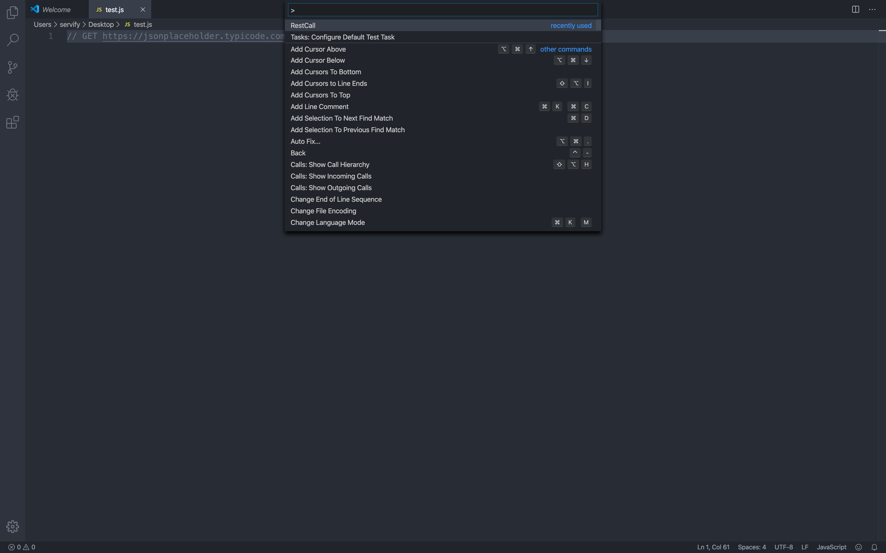
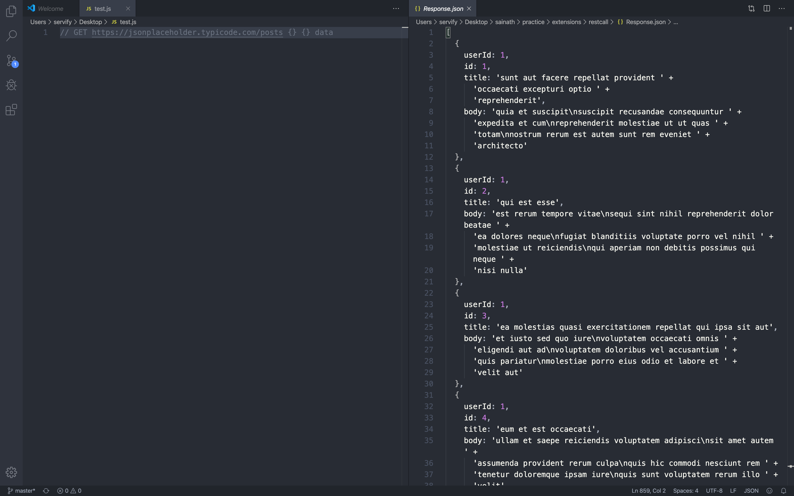

## RestCall
RestCall allows you execute REST APIs and view it's response in Visual Studio Code directly

## Usage

```
// GET https://jsonplaceholder.typicode.com/posts ${HEADER_OBJECT} ${BODY_OBJECT} {EXTRACT_KEY}
```
> `HEADER_OBJECT` and `BODY_OBJECT` must be `inline` and without `space`

* `//` Single line comment, to avoid syntax error (**required**)
* `GET` Http methods, it must be `GET`, `POST`, `PUT` or `DELETE` (**required**)
* `${END_POINT}` absolute path of API endpoint (**required**)
* `${HEADER_OBJECT}` headers config object (**optional**)
* `${BODY}` request body object (**optional**)
* `${EXTRACT_KEY}` extarct key from response object, **e.g** data (i.e show only data property from response) (**optional**)

> Put cursor to rest command and press `cmd + shift + P` to open command prompt

> Enter `RestCall` and select command to call Rest Api



